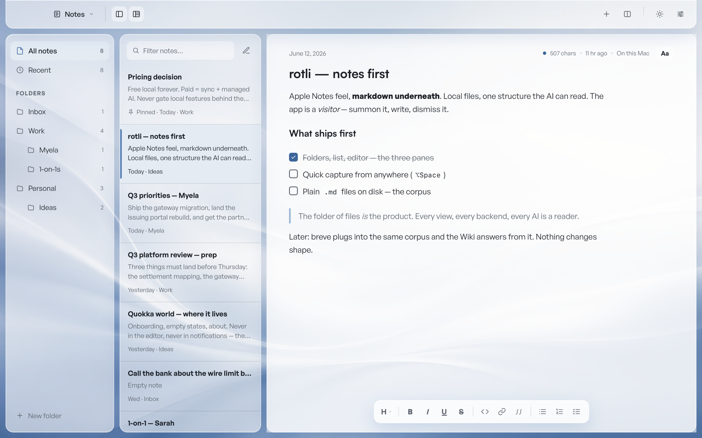

<div align="center">

<picture>
  <source media="(prefers-color-scheme: dark)" srcset="src/brand/logo/wordmark.mono-white.svg">
  
</picture>

**A warm, local-first notes app that lives in your Mac's menu bar.**

*One brain, six fronts — Notes writes it, Chat talks with it, Voice speaks it,<br>the Memory recalls it, Inbox and Board feed it.*


</div>

---

## The promise

Most tools have a resting pulse that's too high — badges, pings, sidebars that never quite close. rotli makes no demands. **You summon it (`⌥Space`), it's there. You dismiss it, it's gone.** No dock icon, no ⌘Tab entry, no noise. Only your work has a pulse.

And your work is **yours**: every note is a plain markdown file in `~/Documents/rotli`. Folders on disk are folders in the sidebar. Open them in any editor, back them up however you like, keep them forever. rotli is just a warm window onto them.

```
~/Documents/rotli/
  Inbox/
    welcome-to-rotli-…md     ← plain markdown, a 4-line frontmatter (id · created · updated · pinned)
  Work/
  .rotli/                    ← settings · view state · index — delete it, lose nothing but a rebuild
```

## What's built

- **The editor** — hybrid markdown: the line under your caret shows raw syntax, everything else renders. `- ` starts a list and `Enter` continues it, `[ ]` + space makes a checkbox, and a quiet 11-control format bar floats below. Typography (`Aa`) is a styling layer — never written into your files.
- **Panes & tabs** — split with the titlebar buttons or `⌘D`/`⌘⇧D`, tabs with `⌘T`; one tab means zero tab chrome. Everything drag-resizable, everything remembered.
- **⌘K** — notes and every action in one palette, recents first.
- **Quick capture** — `⌥C` from anywhere on your Mac: one breath, type, `⏎` — the thought is a file in Inbox.
- **Autosave** — the olive dot. No spinners, ever.
- **Every hotkey rebindable** — one registry, searchable in Settings.

## Six appearances (and liquid glass)

Warm Light · Warm Dark · Paper · Charcoal — and **Liquid Glass**, a mode over any of them: floating glass panels over a tinted field or a bundled wallpaper (or your own image), four hues, frosted or clear, with a paper writing canvas if you want ink-on-linen inside the glass.

<div align="center">


</div>

<div align="center">

| | | | | |
|:-:|:-:|:-:|:-:|:-:|
|  |  |  |  |  |
| Cocoa | Clay Blush | Peach Cream | Linen | Olive Moss |

</div>

## Run it

```sh
bun install
bun run tauri dev   # the app (menu bar · ⌥Space opens · ⌥C captures)
bun run dev         # frontend only, in a plain browser (in-memory demo corpus)
bun run check       # tsc strict + raw-hex lint
cargo test          # the corpus layer (run inside src-tauri/)
```

**Stack** — Tauri v2 · React 18 · Vite · TypeScript strict · Bun · Zustand + TanStack Query · plain CSS driven entirely by the frozen rotli brand kit (vendored at `src/brand/`, v1.0.0, read-only). Local-first is the architecture, not a feature: nothing phones home, nothing requires an account, offline is the default.

## Where it's going

| | |
|---|---|
| ✅ | Shell · panes & tabs · hybrid editor · ⌘K · themes & liquid glass |
| ✅ | **The corpus** — plain files, atomic writes, fs watcher, persistence |
| ⏳ | The index — SQLite FTS5; ⌘K becomes true full-text search |
| ⏳ | Dictation — bundled local STT (Parakeet), cleanup by default → **v1** |
| 🌅 | Chat · Voice · the Memory · Inbox · Board |

---

<div align="center">
<picture>
  <source media="(prefers-color-scheme: dark)" srcset="src/brand/logo/r-mark.mono-white.svg">
  
</picture>

*Warm, quiet, instant. Free local forever.*

</div>
