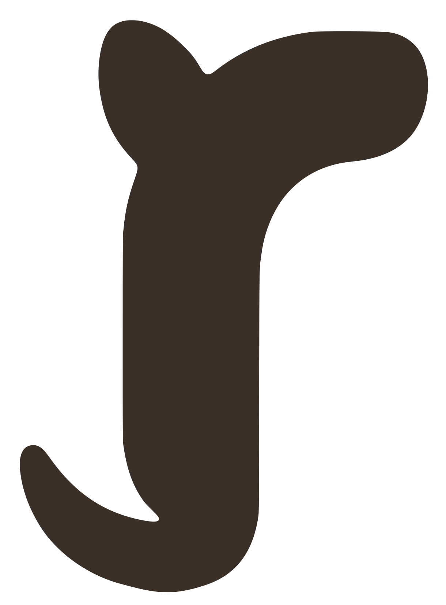

<div align="center">

<picture>
  <source media="(prefers-color-scheme: dark)" srcset="src/brand/logo/wordmark.mono-white.svg">
  
</picture>

**A warm, local-first notes app that lives in your Mac's menu bar.**

*Your notes folder **is** a memex — one local folder for your notes, chats, and knowledge.<br>Three fronts over it: **Notes** you write · **Chat** you talk with · **Inbox** for your email.*

**[⬇ Download for Mac](https://github.com/SethMed7/rotli-releases/releases/latest)** — macOS · Apple Silicon · always the newest signed build


</div>

---

## The promise

Most tools have a resting pulse that's too high — badges, pings, sidebars that never quite close. rotli makes no demands. **You summon it (`⌥Space`), it's there. You dismiss it, it's gone.** No dock icon, no ⌘Tab entry, no noise. Only your work has a pulse.

And your work is **yours**: every note is a plain markdown file in a single local folder you choose — one folder that *is* your memex. Folders on disk are folders in the sidebar. Open them in any editor, back them up however you like, keep them forever. rotli is just a warm window onto them.

```
your notes folder/           ← one folder = your memex; openable in any editor
  a-note.md                  ← plain markdown + a small frontmatter (id · created · updated …)
  wiki/                      ← the AI-organized "brain" (People · Projects · Research …)
  chats/                     ← your AI conversations
  storage/                   ← files · images · PDFs, referenced from notes
  .rotli/                    ← settings · view state · index — delete it, lose nothing but a rebuild
```

## What's built

- **The editor** — hybrid markdown: the line under your caret shows raw syntax, everything else renders. `- ` starts a list and `Enter` continues it, `[ ]` + space makes a checkbox, and a quiet 11-control format bar floats below. Typography (`Aa`) is a styling layer — never written into your files.
- **Panes & tabs** — split with the titlebar buttons or `⌘D`/`⌘⇧D`, tabs with `⌘T`; one tab means zero tab chrome. Everything drag-resizable, everything remembered.
- **⌘K** — notes and every action in one palette, recents first.
- **Quick capture** — `⌥C` from anywhere on your Mac: one breath, type, `⏎` — the thought is a note in Captures, and the AI files it into the right area later.
- **Autosave** — the olive dot. No spinners, ever.
- **Every hotkey rebindable** — one registry, searchable in Settings.

## Four themes — and Liquid Glass

Four base looks the titlebar sun cycles through — **Warm Light · Warm Dark · Paper · Charcoal**. Warm Light is the default. On top of any of them, turn on **Liquid Glass**: floating glass panels over a tint (**Dusk · Blush · Clay · Olive**) or your own wallpaper, frosted or clear, with an optional ink-on-linen writing canvas.

<div align="center">


</div>

## Run it

```sh
bun install
bun run tauri dev   # the app (menu bar · ⌥Space opens · ⌥C captures)
bun run dev         # frontend only, in a plain browser (in-memory demo corpus)
bun run check       # tsc strict + raw-hex lint
cargo test          # the corpus layer (run inside src-tauri/)
```

**Stack** — Tauri v2 · React 18 · Vite · TypeScript strict · Bun · Zustand + TanStack Query · plain CSS driven entirely by the in-repo rotli brand kit (`src/brand/`, v1.0.0 — the single source of truth for colors, type, and logo, enforced by `bun run check:hex`: no raw hex lives outside it). Local-first is the architecture, not a feature: nothing phones home, nothing requires an account, offline is the default.

## Where it's going

| | |
|---|---|
| ✅ | Shell · panes & tabs · hybrid editor · ⌘K · themes & liquid glass |
| ✅ | **Your notes folder is a memex** — plain files, atomic writes, fs watcher, persistence |
| ✅ | **Search** — full-text across your notes (titles + bodies), instant |
| ✅ | **Chat** — on-device by default, or your own connected models (Claude Code · Codex · Antigravity CLIs); your notes are its knowledge base |
| ✅ | **The brain** — an on-device organizer files your captures into areas (People · Projects · Research), fully journaled + undoable |
| ⏳ | **Inbox** — a calm layer over your own email |

---

<div align="center">
<picture>
  <source media="(prefers-color-scheme: dark)" srcset="src/brand/logo/r-mark.mono-white.svg">
  
</picture>

*Warm, quiet, instant. Free local forever.*

</div>
