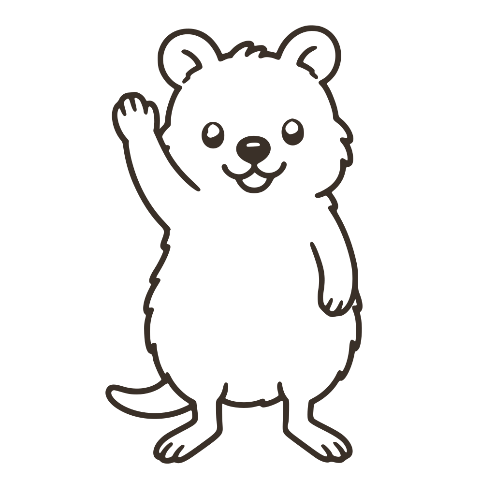
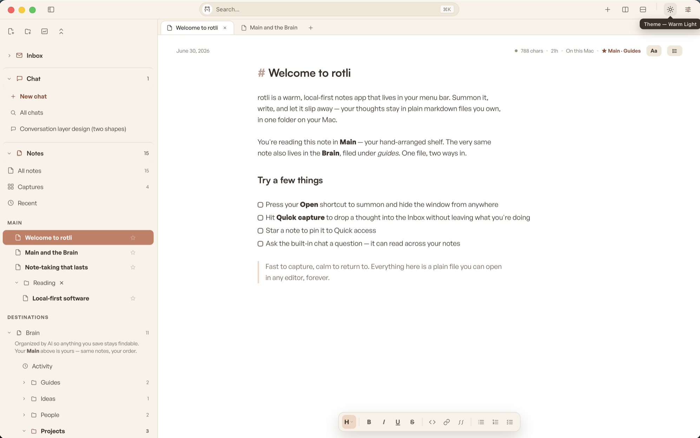
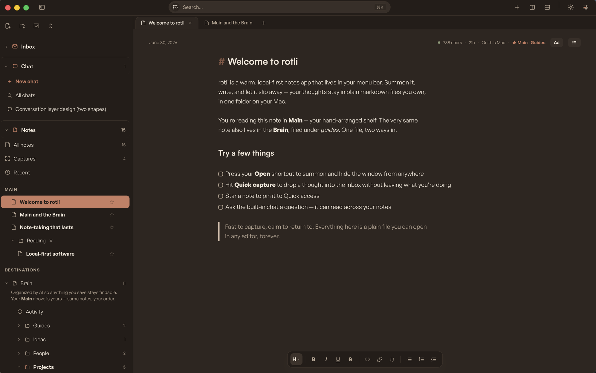
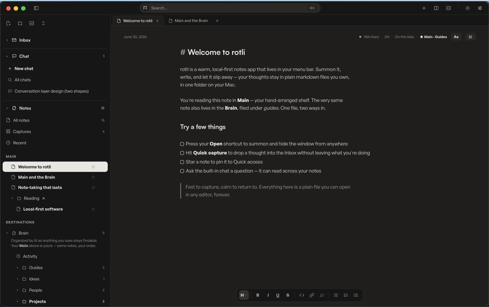
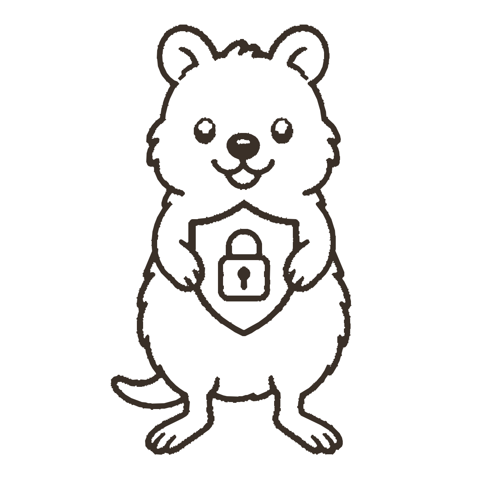

<div align="center">

<picture>
  <source media="(prefers-color-scheme: dark)" srcset="docs/media/quokka-waving.inv.svg">
  
</picture>

# rotli

**A warm, local-first notes app that lives in your Mac's menu bar.**

*`⌥Space` and it's there. Dismiss it and it's gone. Your notes stay plain files on your Mac — yours to keep, forever.*

**[⬇&nbsp; Download for Mac](https://github.com/SethMed7/rotli-releases/releases/latest)** &nbsp;·&nbsp; macOS · Apple Silicon · always the newest signed build

<br>



</div>

---

## Meet rotli

Most apps want your attention. rotli wants to get out of your way.

It lives in your menu bar — **no dock icon, no ⌘Tab entry, no badges, no pings.** Summon it with `⌥Space`, jot what's in your head, and dismiss it; it's gone until you need it again. The only thing here with a pulse is your work.

And everything you write is **yours**: plain markdown in one folder *you* choose. Open it in any editor, back it up however you like, keep it when rotli is long forgotten. rotli is a warm window onto your files — never their owner.

## One folder is your whole brain

Your notes folder *is* a **memex** — one local folder that quietly holds everything:

```
your notes folder/          ← one folder = your memex, openable in any editor
  a-note.md                 ← plain markdown + a little frontmatter (id · created · updated …)
  wiki/                     ← the AI-organized "brain" — People · Projects · Research …
  chats/                    ← your AI conversations
  storage/                  ← files, images, PDFs, boards — referenced from notes
  .rotli/                   ← the app's own state; delete it and lose nothing but a rebuild
```

You just capture. A small **on-device** AI files each note into the **brain** — the areas like *People*, *Projects*, and *Research*. You never have to think about where a note goes, yet it's always exactly where you'd look for it.

## Main and the brain — one file, two ways in

This is the idea rotli is built around, so it's worth thirty seconds:

- **Main** is *your* shelf — the notes you reach for, arranged by hand, in whatever order makes sense to you.
- **The brain** is where those same notes actually live on disk, filed into tidy areas by the AI.

They aren't copies. They're the **same file**, reached two ways. Rearrange Main all you like; the brain keeps everything findable. Let the AI refile the brain; your Main arrangement never moves. Your order, and a tidy library, at the same time — and the AI only ever touches a note's *location and metadata*, **never the words inside it** (every change is journaled and undoable).

Main can also open additional named **views** for focused slices such as a
project, client, or open-source work. Main keeps every referenced item; a named
view adds its own virtual folders and one `view_tag` to Markdown metadata. New
items and folders follow the view you are currently in, while the underlying
file still enters the same intake/Brain workflow.

## Three fronts, one window

| Front | What it is |
|---|---|
| **Notes** | The note system — a hybrid-markdown editor that hides syntax until your caret lands on it, plus Excalidraw **boards**, all saved as plain files. |
| **Chat** | Your AI conversations. On-device by default, or your own connected models (Claude Code · Codex · Antigravity). Your notes are its knowledge base — it reads them to answer. |
| **Inbox** | A calm layer over your own email. *(coming)* |

## What's built

- **The editor** — hybrid markdown: the line under your caret shows raw syntax, everything else renders. `- ` starts a list, `[ ]` makes a checkbox, and a quiet format bar floats below. Mermaid diagrams open into a View/Visual/Code workspace: flowcharts can be built from shapes, arrows, labels, direction, and colors without leaving Mermaid, while an optional conversion creates a separate Excalidraw board copy. Typography (`Aa`) is a render layer — never written into your files.
- **Panes & tabs** — split with `⌘D` / `⌘⇧D`, tabs with `⌘T`; one tab means zero tab chrome. Everything drag-resizable, everything remembered.
- **`⌘K`** — every note and action in one palette, recents first.
- **Quick capture (`⌥C`)** — from anywhere on your Mac: one breath, type, `⏎` — the thought lands in Captures and the AI files it later.
- **Chat that knows your notes** — on-device by default; connect the subscription CLIs you already use; attach images; flip the globe for a web lookup.
- **Autosave** — a quiet olive dot. No spinners, ever.
- **Every hotkey rebindable** — one searchable registry in Settings.

## A workspace, not a preview catalog

Images and video are the only file types Rotli may treat as view-only media.
Every other format shown as supported must be something you can work on and
save in Rotli. When a format cannot yet be edited faithfully, Rotli should offer
an explicit local conversion or import workflow and call the format unsupported
until that workflow exists—never ship a passive “preview only” dead end.

Markdown is the foundation Rotli is built around and remains the primary
knowledge surface. Slash commands, wikilinks, typed embed fences, frontmatter,
and note-native workflows belong to Markdown only. DOCX documents, spreadsheets,
and Excalidraw boards are useful bonus work surfaces—not parallel note systems—
and keep the conventional behavior of their own formats.

## Four work environments

The titlebar sun cycles through **Warm Light · Warm Dark · Paper · Charcoal**.
Paper and Charcoal are the calm defaults; the warm pair is there for people who
prefer a softer environment. Every product surface shares the same semantic
tokens, keyboard behavior, and readable hierarchy across all four.

<div align="center">

&nbsp;

</div>

## Your data stays yours

<picture>
  <source media="(prefers-color-scheme: dark)" srcset="docs/media/quokka-shield.inv.svg">
  
</picture>

- **Plain Markdown files** on your Mac — open them in any editor, back them up, keep them forever.
- **Secrets are auto-detected** and never sent to a remote model or out to the web.
- **Works fully offline** — no account, nothing phones home.

You work how you want in **Main**; the AI organizes the **brain** underneath — location and metadata only, never the words inside your notes.

*Built on [memex](https://github.com/SethMed7/memex) — the open foundation for how your data is organized.*

<br clear="all">

## Run it

```sh
bun install
bun run tauri dev   # the app (menu bar · ⌥Space opens · ⌥C captures)
bun run dev         # frontend only, in a plain browser (in-memory demo memex)
bun run check       # TypeScript, tests, runtime, architecture, design, and docs
cargo test --manifest-path src-tauri/Cargo.toml
```

## Use your workspace from Claude, Codex, or the shell

The installed Rotli executable is also a JSON CLI and a local stdio MCP server.
Both use the same corpus policy as the app: new notes enter intake and appear in
Main, secure notes stay unavailable to remote agents, locked notes refuse agent
edits, and updates require a fresh revision.

```sh
/Applications/rotli.app/Contents/MacOS/rotli notes list
/Applications/rotli.app/Contents/MacOS/rotli notes search "launch plan"
/Applications/rotli.app/Contents/MacOS/rotli notes query 'area:projects tags:payments updated:>=2026-07-01'
/Applications/rotli.app/Contents/MacOS/rotli notes create --title "Launch plan" --body "First draft"
/Applications/rotli.app/Contents/MacOS/rotli rename "Launch plan" "Launch plan v2"
/Applications/rotli.app/Contents/MacOS/rotli agent doctor
/Applications/rotli.app/Contents/MacOS/rotli agent self-test
/Applications/rotli.app/Contents/MacOS/rotli agent config
```

The doctor is read-only, the self-test uses a disposable memex, and the final
command prints copy-ready Claude Code and Codex MCP configuration for that exact
installed binary. Note results identify themselves as Markdown and include
document metrics; Rotli keeps YAML frontmatter outside the agent-editable body.
The server is stdio-only and loads tools on demand; it does not open a local
network port or silently change global agent settings. Full commands and policy
live in the [`agent workspace contract`](docs/architecture/agent-workspace.md).

Contributing or working with an AI coding tool? Start with
[`CONTRIBUTING.md`](CONTRIBUTING.md), [`AGENTS.md`](AGENTS.md), and the
[`documentation map`](docs/README.md).

**Stack** — Tauri v2 · React 18 · Vite · TypeScript strict · Bun · Zustand + TanStack Query · plain CSS driven entirely by the in-repo brand kit (`src/brand/`, v1.0.0 — the single source of truth for colors, type, and logo, enforced by `bun run check:hex`). Local-first is the architecture, not a feature: nothing phones home, nothing needs an account, offline is the default.

## Where it's going

|  |  |
|---|---|
| ✅ | Shell · panes & tabs · hybrid editor · `⌘K` · four work environments |
| ✅ | **Your notes folder is a memex** — plain files, atomic writes, fs watcher, persistence |
| ✅ | **Search** — full-text across your notes (titles + bodies), instant |
| ✅ | **Chat** — on-device by default, or your own connected models; your notes are its knowledge base |
| ✅ | **The brain** — an on-device organizer files your captures into areas, fully journaled + undoable |
| ⏳ | **Inbox** — a calm layer over your own email |

---

<div align="center">

<picture>
  <source media="(prefers-color-scheme: dark)" srcset="docs/media/quokka-celebrating.inv.svg">
  
</picture>

**Warm, quiet, instant. Free and local, forever.**

</div>
