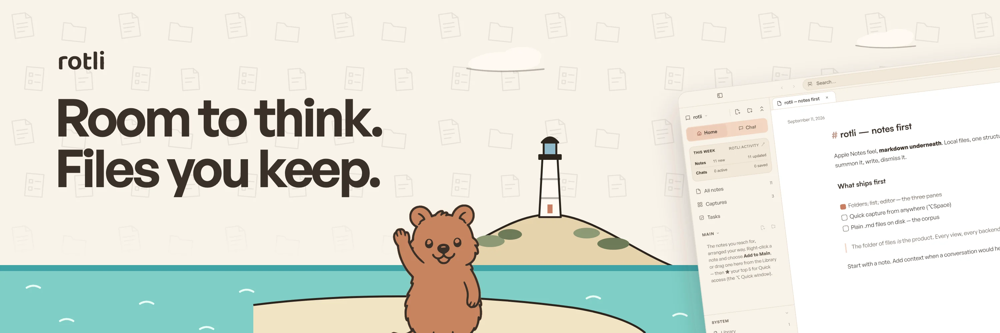
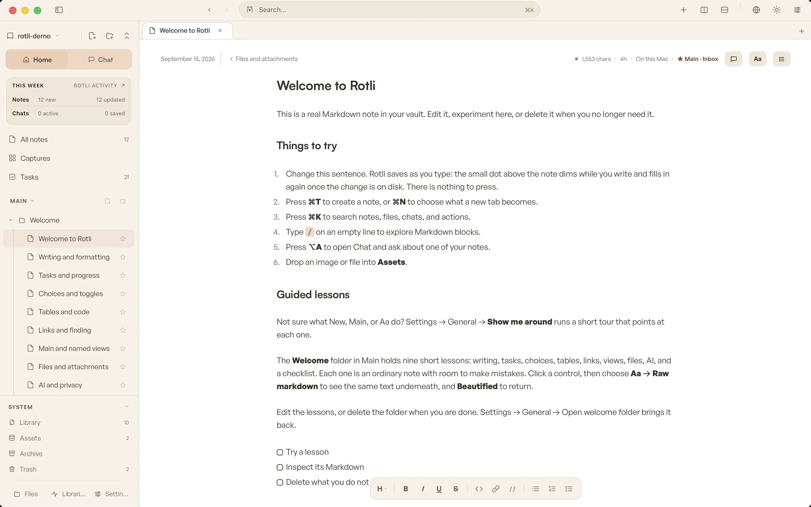
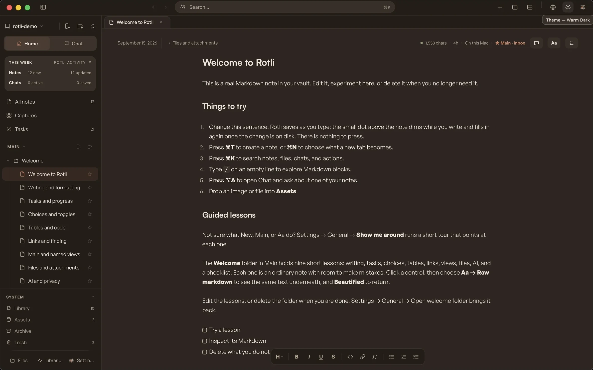
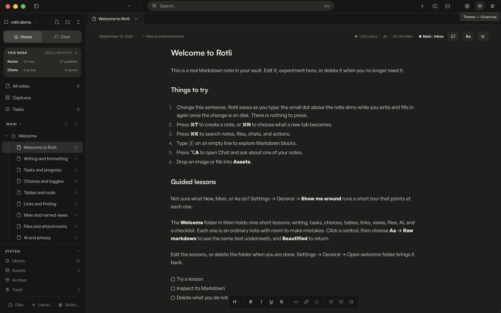
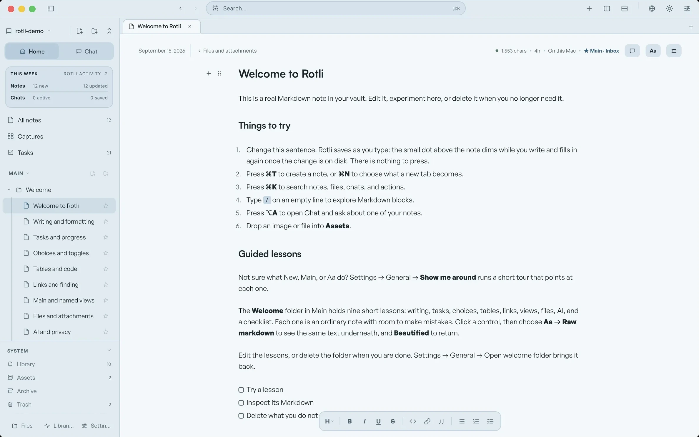
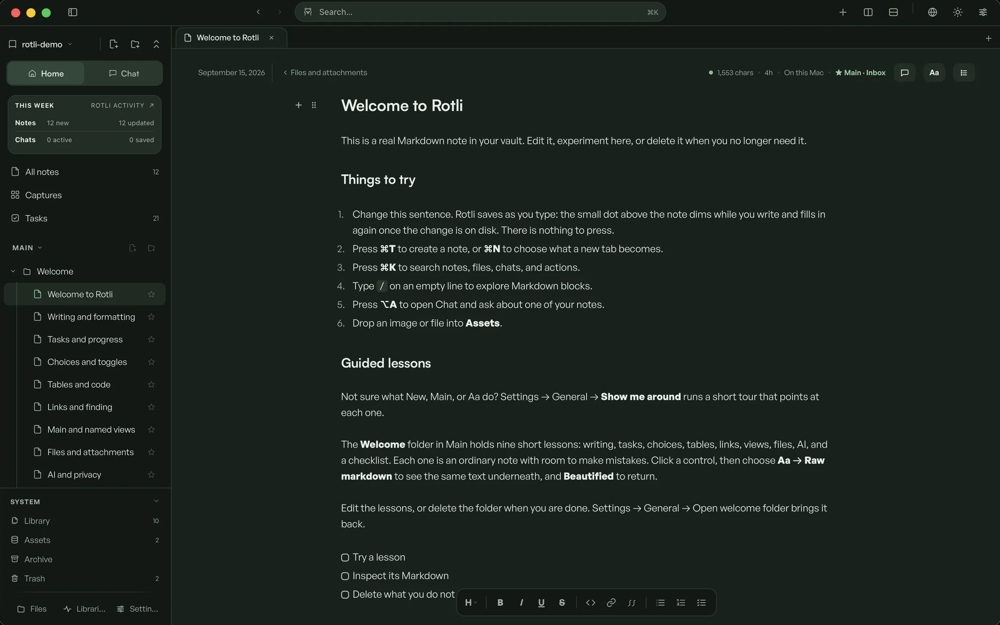
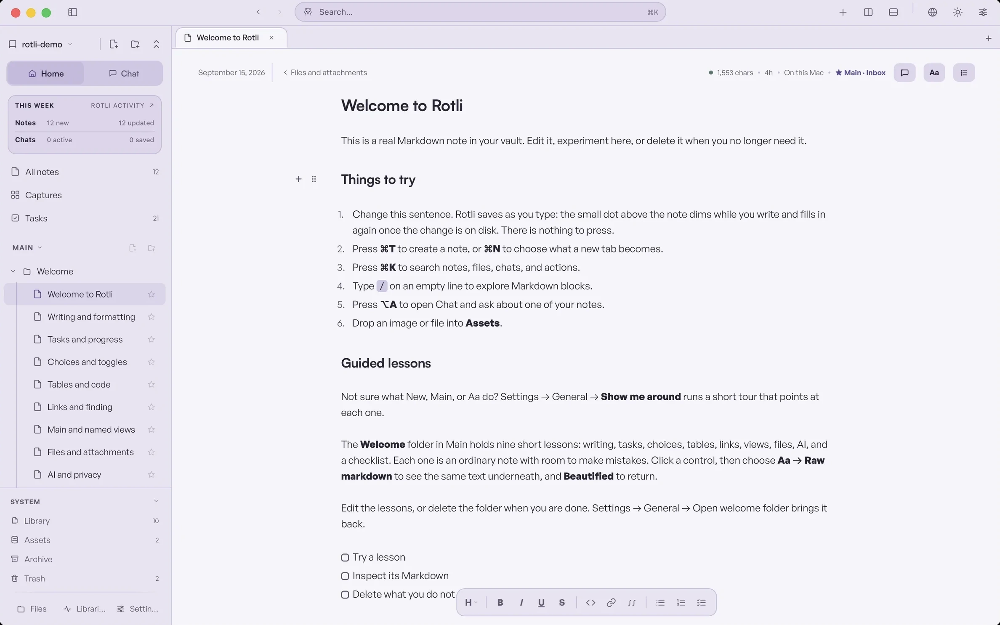
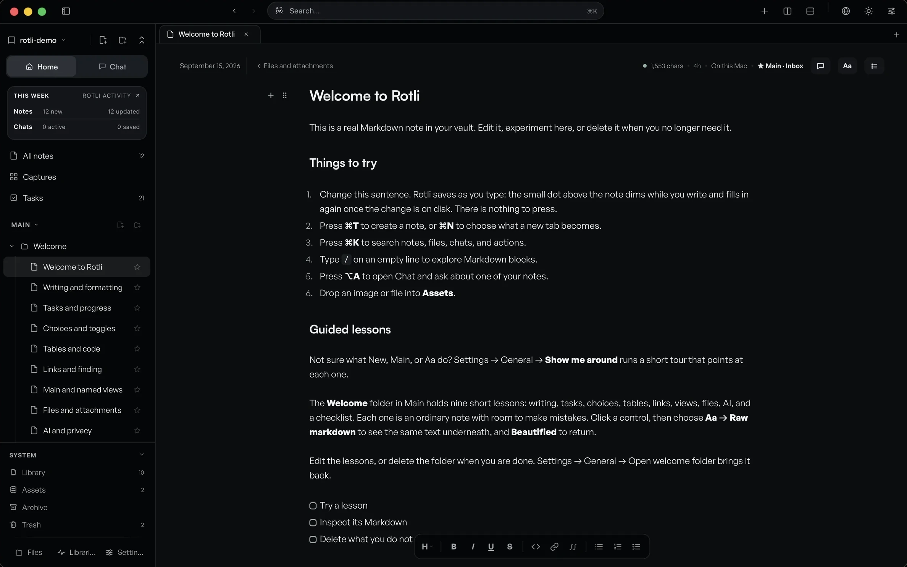

<picture>
  <source media="(prefers-color-scheme: dark)" srcset="docs/media/readme-banner-night.webp">
  
</picture>

<div align="center">

# Rotli

A calm, local-first workspace for your Mac. One folder is your vault, the
Librarian keeps it organized, and every note stays a plain file you own.

[**Download for Mac**](https://github.com/SethMed7/rotli-releases/releases/latest/download/Rotli.dmg) &nbsp;·&nbsp;
[rotli.co](https://rotli.co) &nbsp;·&nbsp; macOS on Apple Silicon · signed and notarized

<br>



</div>

---

## Meet Rotli

Most apps want your attention. Rotli stays out of the way.

Press `⌥Space` and it is there; press it again and it is gone. Write what is on
your mind, then get back to your day. There are no badges, no streaks, and no
pings.

Everything you write is **yours**: plain Markdown in one folder you choose.
Open it in any editor, back it up however you like, and keep it long after you
stop using Rotli. Rotli is a window onto your files, never their owner.

## One folder is your vault

```
your vault/                 one folder, openable in any editor
  wiki/                     the Library: People · Projects · Research …
  wiki/_secure/             secure notes, kept away from remote AI
  chats/                    your conversations
  storage/                  documents, boards, images, and files
  .rotli/                   Rotli's own state; delete it and lose only a rebuild
```

You capture. The **Librarian** files each note into an area of the Library,
adds a summary and tags, and records what it did with a guarded undo. It uses
an on-device model by default, or a Claude, ChatGPT, or Gemini client you have
already signed in to. It changes a note's location and metadata only, never the
words you wrote. Prefer no AI at all? Choose a **raw vault**, and the Librarian
never runs.

Already have an Obsidian, ZenNotes, or plain Markdown folder? First run can
inspect it without writing anything, then open it in place or import a copy.

## Work in a view, however you like

- **Main** is your own shelf: the notes you reach for, arranged by hand. The
  Library underneath stays tidy, and a note in Main is the same file on disk,
  not a copy.
- **Named views** give a project or client its own focused Main. New notes
  follow the view you are in.
- **Remove from Main** takes a note out of view; the file stays in your vault.
- **Delete** moves it to **Trash** inside the vault. Nothing leaves your disk
  until you choose **Empty Trash**.
- **Files**, at the foot of the sidebar, browses the vault folder the way
  Finder does, so there is nothing new to learn.

## Secure notes stay secure

Mark a note **secure** and Rotli moves it to `wiki/_secure/` and keeps it away
from remote models and web lookups; the Librarian leaves it alone. Rotli also
recognizes common secret shapes (API keys, private keys, card and identity
numbers) and treats them the same way. Remote models never see secure content;
on-device models can, unless you turn that off.

## What's inside

- **The editor.** Hybrid Markdown shows raw syntax only on the line you are
  editing. Lists, checkboxes, choices, switches, tables, wikilinks (`[[`), and
  Mermaid diagrams render in place. Choose **Aa → Raw markdown** to see the
  text underneath.
- **Chat that knows your notes.** On-device by default, or through an
  official Claude Code, Codex, or Cursor client already installed on your
  Mac. Rotli never shows a provider login or reads provider credentials.
  Flip the globe for a web lookup.
- **Documents and boards.** Word documents (`.docx`) and Excalidraw boards open
  and save in their own formats, alongside your notes.
- **Quick capture** with `⌥C` from anywhere; the thought lands in Captures and
  gets filed later.
- **`⌘K`** finds every note, file, chat, and action. `⌘T` starts a note and
  `⌘N` chooses what a new tab becomes.
- **Panes and tabs** split with `⌘D` and `⌘⇧D`; every hotkey can be rebound.
- **The Welcome folder** holds nine short lessons, plus a guided tour of the
  real controls. **Settings → General → Show me around** runs it again.

Spreadsheets, Mermaid diagram tabs, and read-aloud are coming soon and are not
in this release.

## Seven families, light and dark

The titlebar sun switches between paired light and dark environments in seven
families: **Rotli · Paper & Charcoal · Ocean · Grove · Iris · Blossom · Midnight**. Every
first run starts in Rotli Light; below is one environment from each family.

<div align="center">
<table>
  <tr>
    <td></td>
    <td></td>
    <td></td>
  </tr>
  <tr>
    <td align="center">Rotli Dark</td>
    <td align="center">Charcoal</td>
    <td align="center">Ocean Light</td>
  </tr>
  <tr>
    <td></td>
    <td></td>
    <td></td>
  </tr>
  <tr>
    <td align="center">Grove Dark</td>
    <td align="center">Iris Light</td>
    <td align="center">Midnight</td>
  </tr>
</table>
</div>

## Your data stays yours

<picture>
  <source media="(prefers-color-scheme: dark)" srcset="docs/media/quokka-shield.inv.svg">
  
</picture>

- **Plain Markdown files** on your Mac, readable by any editor, forever.
- **No account.** Rotli works fully offline. Connected models, web research, and
  updates use the network only when you choose them.
- **Secure notes and secret-shaped text** never reach a remote model or the web.
- **The Librarian** changes location and metadata only, and a raw vault turns
  AI off entirely.

See [`PRIVACY.md`](PRIVACY.md) for the full data boundary.

<br clear="all">

## Use your workspace from the shell

The installed app is also a JSON CLI that follows the same rules as the app:
new notes enter intake and appear in Main, secure notes stay unavailable to
agents, locked notes refuse edits, and every update needs a fresh revision.

```sh
/Applications/rotli.app/Contents/MacOS/rotli notes list
/Applications/rotli.app/Contents/MacOS/rotli notes search "launch plan"
/Applications/rotli.app/Contents/MacOS/rotli notes query 'area:projects updated:>=2026-07-01'
/Applications/rotli.app/Contents/MacOS/rotli notes create --title "Launch plan" --body "First draft"
```

The MCP server, `rotli agent …` commands, and remote agents are development
builds only for now. The [agent workspace contract](docs/architecture/agent-workspace.md)
has the details.

## Build it

```sh
bun install --frozen-lockfile
bun run dev:app     # the native app in development, with live vault switching
bun run dev         # the frontend alone, in a browser with an in-memory demo vault
bun run verify      # CI's local twin: checks, builds, Playwright, clippy, cargo test
```

Contributing, or working with an AI coding tool? Start with
[`CONTRIBUTING.md`](CONTRIBUTING.md), [`AGENTS.md`](AGENTS.md), and the
[documentation map](docs/README.md). Repository skills for every agent live in
[`.agents/skills/`](.agents/skills). Report security issues through
[`SECURITY.md`](SECURITY.md). Rotli is released under the [MIT license](LICENSE).

**Stack:** Tauri 2 · React · Vite · TypeScript (strict) · Bun · Rust · plain CSS
from the in-repo brand kit (`src/brand/`).

## Where it's going

|  |  |
|---|---|
| ✅ | **1.0**: the editor, panes and tabs, `⌘K`, six environment families |
| ✅ | **The Librarian** files your notes, with an activity record and guarded undo |
| ✅ | **Chat** on-device or through your own connected clients, grounded in your notes |
| ✅ | **Secure notes** kept away from remote AI and the web |
| ✅ | **Documents and boards** saved in their own formats |
| ⏳ | Spreadsheets · email Inbox · mobile and tablet · handwriting ([roadmap](ROADMAP.md)) |

---

<div align="center">

<picture>
  <source media="(prefers-color-scheme: dark)" srcset="docs/media/quokka-celebrating.inv.svg">
  
</picture>

**Calm, local, and yours.**

</div>
