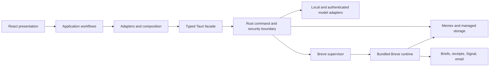

# Rotli, memex, and Breve system audit — 2026-07-11

## Executive outcome

Rotli has sound local-first boundaries and unusually strong security enforcement for its age. The
system is not held back by a wrong architecture; it is held back by a few large modules, duplicated
cross-process contracts, and visual rules that were historically enforced by convention rather than
mechanically. There are no release-blocking architectural failures in the inspected paths.

The best next move is incremental decomposition around the existing capability seams, not a rewrite or
a new framework. Keep the memex as the durable file contract, keep model/provider execution in Rotli,
and make every cross-layer contract executable in the regression suite.

## System map

The intended dependency direction is correct:

`domain → application → adapters → composition → presentation`

The new-item, document, chat-memory, and memex-model-map features already follow this direction. The
new regression guard automatically protects clean features that contain both `workflow.ts` and
`composition.ts`, and prevents new feature code from importing Tauri directly.

## Memex architecture

### What is working well

- `memex.json` provides stable identity, contract version, and additive app registration.
- The file format—not an imported implementation—is the cross-repository API. This lets Rotli open a
  missing or older memex without module-load coupling.
- Knowledge remains Markdown and inspectable metadata. `.rotli/` state and indexes are projections;
  they are not a hidden source of truth.
- Main is an ordered view of references. It does not duplicate content.
- Binaries live in a configured media/managed-storage lane and are referenced from the text spine.
- Secure-note rules are represented in portable metadata and independently enforced by Rust. Remote
  providers cannot read secure notes; local AI requires explicit per-note permission.
- The memex correctly owns protocols, prompts, capability maps, and deterministic tools while Rotli
  owns provider calls, ranking execution, and agent orchestration.

### Risks

1. **Template-to-instance engine drift.** The current `~/memex-vault` is contract 3.7, but its
   `client.ts`, `mounts.ts`, `validate.ts`, and `organize.ts` do not have the same fingerprints as the
   current public template. Some drift is legitimate instance evolution, but there is no manifest that
   distinguishes an intentional override from a missed engine migration. The private vault was only
   inspected; no files were changed.
2. **Contract compatibility is versioned, engine migration is not.** Rotli safely gates the file
   contract, but deterministic script upgrades are currently copy-based. Add an engine manifest with
   version/hash plus idempotent migrations. Never overwrite knowledge or user-owned config.
3. **Two model-policy projections can disagree.** `clients/models.json` and `client.ts` describe model
   profiles, while Rotli also derives budgets from model id/context class. Normalize both into one pure
   capability value at the Rotli adapter boundary; the memex remains declarative and makes no calls.

## Retrieval and chat memory

The current retrieval design is a valid local-first hybrid RAG system:

1. Model Map 0 supplies a bounded, priority-aware catalog.
2. Search expands inspectable keywords and merges full-text note results with chat matches.
3. `read_memory` opens only selected sources and retains note/chat provenance.
4. Context, history, snippets, scratch space, reads, and tool steps are all model-budgeted.
5. Embeddings are optional acceleration rather than authoritative state.

One naming/expectation gap should be corrected: the background “Conversation memory” is currently a
bounded compact transcript of the latest 24 turns, not a semantic summary. This is safe and
deterministic, but it does not yet distill decisions, people, commitments, or durable facts across a
long conversation. A future distillation adapter should preserve the compact transcript as fallback,
write a visibly managed summary block, cite the source chat, and obey the same secure/local-model gates.

## Rotli application architecture

### Strong seams

- `src/newItems/` gives every creation entry point one vocabulary and workflow.
- `src/documents/` isolates OOXML encoding/editing, the Univer adapter, ports, and composition.
- `src/chatMemory/` separates deterministic memory shaping/retrieval from storage and UI.
- `src/lib/tauri.ts` gives the browser-safe frontend a typed shell boundary.
- Rust independently validates paths, extensions, permissions, contract bands, reserved metadata, and
  secure-note access. Frontend allowlists are never trusted as security controls.
- Heavy editor dependencies are generally loaded at the feature boundary or on first use.

### Main maintainability hotspots

| Module | Approx. lines | Responsibility to extract first |
|---|---:|---|
| `src-tauri/src/corpus.rs` | 6,753 | file policy, metadata codec, search, managed assets, command adapters |
| `src-tauri/src/organizer.rs` | 3,668 | candidate selection, prompt/application policy, journal/status |
| `settingsSurface.tsx` | 2,306 | one pane module per settings concern |
| `sidebar.tsx` | 2,059 | projection, gestures, row commands, visible sections |
| `breveSurface.tsx` | 1,633 | one Breve page per presentation module |
| `lib/tauri.ts` | 1,418 | shell, corpus, memex, provider, and Breve capability facades |
| `signal-daemon.ts` | 2,220 | transport, session state, intent dispatch, delivery lifecycle |

Splits should preserve public functions and be protected by behavior tests. File size alone is not a
reason to add generic base classes or a dependency-injection framework.

## Breve architecture

Breve is correctly integrated as a Rotli-owned feature:

- Rust materializes the bundled runtime and owns its process lifecycle.
- Mutable configuration and output survive runtime refreshes; executable runtime files are replaced.
- Dev and production source roots are explicit, and scheduler startup remains gated by the managed
  marker and build mode.
- The scheduler prevents overlap, records durable state, checks delivery receipts, handles sleep
  catch-up, and bounds Signal restart backoff.
- The React suite reads/writes through a Breve snapshot API instead of reading runtime files directly.

The main risk is schema duplication across three runtimes: React/TypeScript snapshot types, Rust serde
types, and Breve runtime config types. Contract fixtures currently catch much behavior, but a checked
JSON Schema (or a small generated type artifact) would make field additions deliberate without adding
a runtime framework. The root and bundled Breve dependency ranges are now checked for exact alignment.

## Frontend and design-system audit

### What is coherent

- Four app themes share semantic color roles and one state/radius/motion grammar. Paper and Charcoal
  are the defaults; Warm Light and Warm Dark remain intentional alternatives for people who prefer a
  softer environment.
- Four Breve PDF palettes are separate from app appearance, which is the correct product model.
- Native `color-scheme` follows the selected app theme rather than macOS implicitly.
- Keyboard focus, reduced motion, loading/error/status semantics, and Breve keyboard navigation have
  explicit source-level support.
- The 720px main-window minimum means the product can optimize for native desktop density rather than
  pretending to be a mobile web app. Breve adds narrower layout breakpoints for its denser forms.

### Drift risks and changes made in this audit

- Older styles hard-coded warm cocoa or black RGBA shadows. This made elevation look foreign outside
  the Warm family; two newer surfaces referenced an undefined `--shadow-popover` token.
- Elevation is now one semantic scale (`control`, `raised`, `popover`, `dialog`, `accent`) derived from
  the active theme's text/accent color.
- Product CSS can no longer introduce literal RGB/HSL colors outside token-definition files.
- Breve text now has a mechanically enforced 10px absolute floor. Labels that were 9px were raised.
- The remaining global CSS is still broad: every stylesheet is imported by `app.tsx`, and several are
  over 1,400 lines. Introduce CSS cascade layers (`tokens`, `base`, `components`, `utilities`,
  `overrides`) before doing more theme work; this gives additions a predictable precedence without a
  CSS-in-JS or component-framework migration.
- Liquid Glass was removed from the product and persistence model. Old Glass keys are deliberately
  dropped on the next settings write, while the selected solid family/mode remains intact.
- A browser-seeded theme matrix is still missing. Unit tests verify token registries, but they cannot
  catch clipping, accidental card nesting, or contrast changes in rendered states.

## Dependency and contract audit

- React owns rendering, Zustand local interaction state, and TanStack Query async/server state. This
  separation is appropriate.
- CodeMirror, Excalidraw, Univer/ExcelJS, JSZip/OOXML, Mermaid/KaTeX/JSXGraph are capability adapters,
  not a second UI framework.
- `imapflow` and `kokoro-js` belong to the bundled Breve runtime. They also exist at the root so local
  build validation can resolve them; exact version-range parity is now enforced.
- The new IPC check proves all 116 literal frontend commands resolve to one of the 116 registered Rust
  handlers. It prevents a rename/addition from reaching runtime as an “unknown command” regression.
- Direct Tauri imports are constrained to the shell/composition allowlist. New feature code must use the
  typed facade.
- JSXGraph now uses its interpreter rather than its optional `eval` compiler. Dev and production
  therefore obey the same grammar while the release CSP stays strict.
- The production build still reports large lazy chunks: the sheet session/Univer path is about 5.7 MB
  minified (1.6 MB gzip). It is deferred until the feature opens, but should be profiled before adding
  more workbook plugins; use adapter-level imports before reaching for manual chunk naming.

## Recommended sequence

1. Add a seeded browser-mode visual regression matrix for the four themes, core surfaces, empty/error/
   loading/disabled states, keyboard focus, and 720px/980px/wide widths.
2. Add a memex engine manifest and dry-run migration report. Do not auto-overwrite instance scripts
   until an operator can see intentional overrides versus stale copies.
3. Split `breveSurface.tsx` and `settingsSurface.tsx` along existing page boundaries, then split the
   Rust corpus by policy/use case. Keep exported facades stable during each extraction.
4. Normalize model capabilities once in Rotli and feed that value to budgets, Model Map 0, and provider
   adapters.
5. Add retrieval evaluation fixtures: known question → expected source ids, secure exclusion, long-chat
   recall, alias recall, and no-answer behavior.

## Regression gates added

- Semantic, theme-derived elevation tokens and no literal functional colors in product CSS.
- Breve compact-text minimum.
- Automatic clean-feature boundary discovery.
- Tauri adapter allowlist.
- Frontend-to-Rust IPC command parity.
- Root-to-bundled Breve dependency parity.
- JSXGraph interpreter/CSP compatibility.
